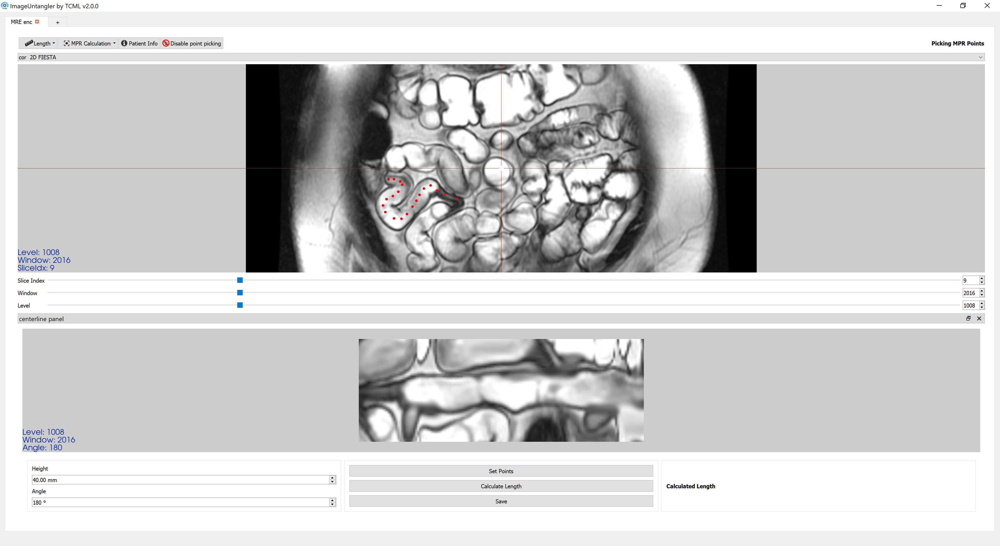

# ImageUntangler

Project to aid Gastroenterologists and biologists to analyze MRI images of the Small Bowel. The main benefit the project hopes to add is MPR for Small Bowel MRI images

Currently under development in [TCML](https://tcml-bme.github.io/) under Professor Moti Freiman.  
Current Developers: Avraham Kahan, Angeleene Ang.  
Project Founder: Yael Zaffrani

## Installation

Run the MainWindow.exe from the release section

### Updating

Overwrite the contents of the zip from the previous release

### Build

See requirements.txt for dependencies.

Run `main.py` in the root folder

To compile with PyInstaller, use the `MainWindow.spec` file for a one-folder install

## Screenshot

## Roadmap

[See the project board](https://github.com/TechnionComputationalMRILab/ImageUntangler/projects/1)

## Usage / Shortcuts

### Mouse

|                  | Display Panel                                        | Centerline Panel                                     |
|------------------|------------------------------------------------------|------------------------------------------------------|
| Left click       | Point picking (if activated)                         | Point picking (if activated)                         |
| Left click drag  | Change level/window (if point picking is not active) | Change level/window (if point picking is not active) |
| Mousewheel       | Change slice index                                   | Change angle                                         |
| Right click drag | Zoom                                                 | Zoom                                                 |

### Keyboard shortcuts

`c` - Disable cursor

#### Debug shortcuts

On main screen:
Ctrl+q - open folder using File Dialog

With an opened case:
Ctrl+d - show coordinates of all points in a dialog box
Ctrl+p - import points from version 3 of ImageUntangler
