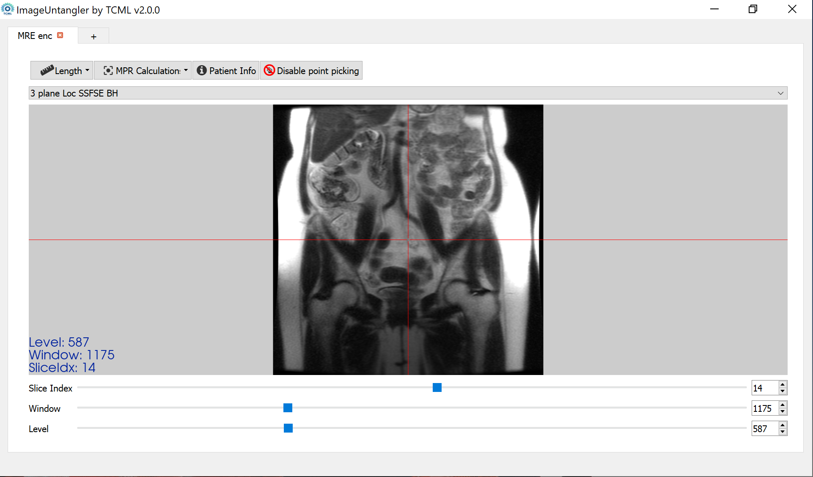

# ImageUntangler

Project to aid Gastroenterologists and biologists to analyze MRI images of the Small Bowel. The main benefit the project hopes to add is MPR for Small Bowel MRI images

Currently under development in [TCML](https://tcml-bme.github.io/) under Professor Moti Freiman.  
Current Developers: Avraham Kahan, Angeleene Ang.  
Project Founder: Yael Zaffrani

## Installation

See requirements.txt for dependencies.

Run `main.py` in the root folder

## Screenshot

## Roadmap

[See the project board](https://github.com/TechnionComputationalMRILab/ImageUntangler/projects/1)

## Usage / Shortcuts

### Keyboard shortcuts

`c` - Disable bullseye