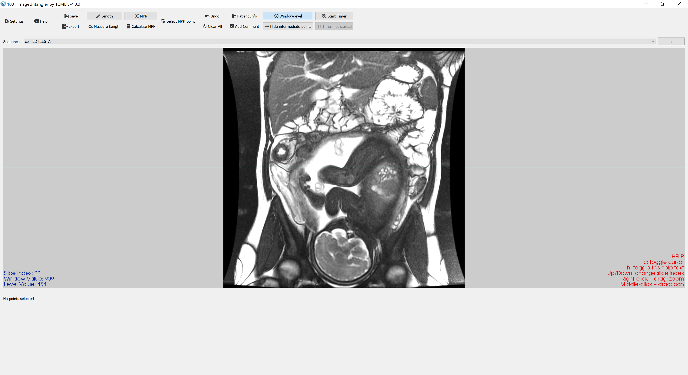
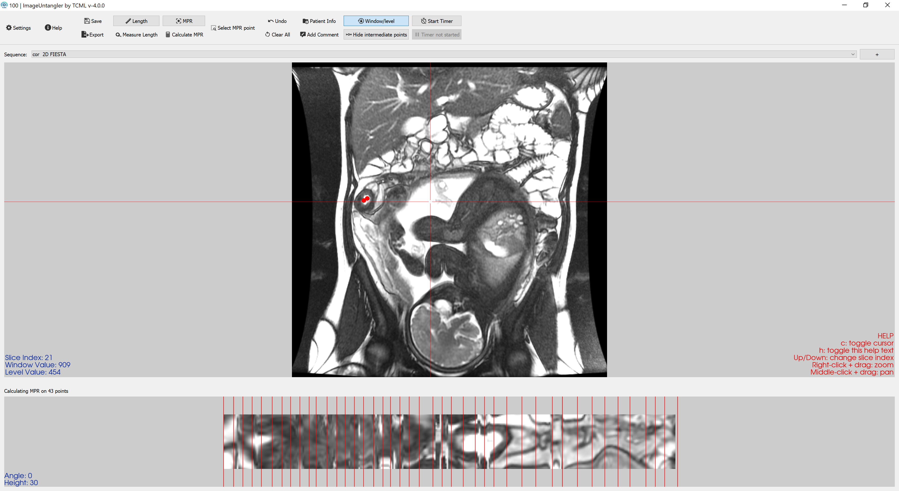

# ImageUntangler

Developed for the Technion Computational MRI lab, this program reads DICOM MRI images and presents a user-friendly interface for radiologists to measure lengths and generate centerlines.

Developed by Angeleene Ang, Yael Zaffrani, Avraham Kahan, and Moti Freiman.

## Usage

GUI: Download the latest release and run the .exe file

CLI: See [this page](commandline_usage.md) for CLI usage

## Screenshots

## Dependencies

### For displaying the images
matplotlib 
numpy
SimpleITK
vtk - The program was developed using 9.1.0
pydicom
pynrrd
scipy

### For the interface
PyQt5
QtAwesome
pytz

### Other
pyinstaller
pytest-qt
pytest

